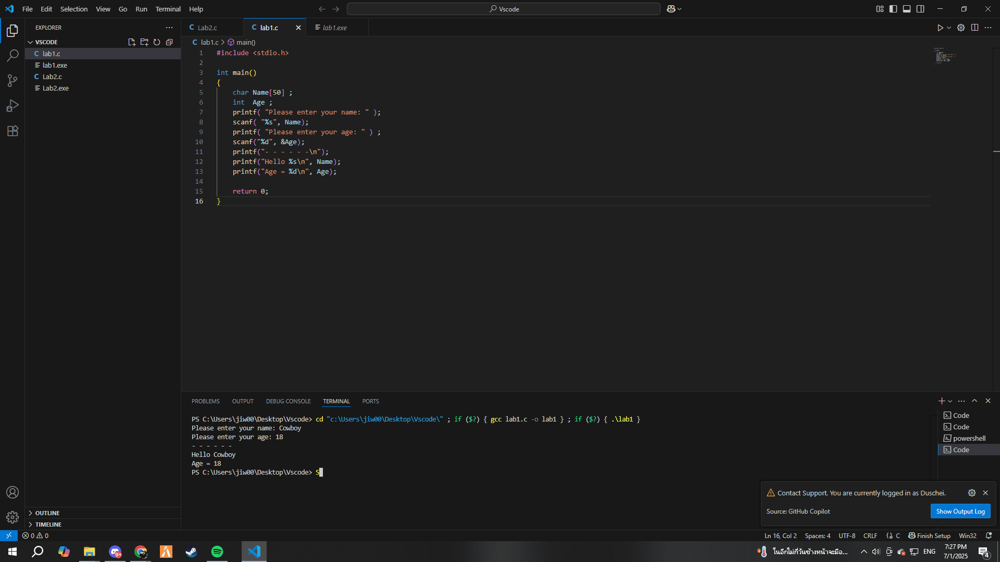

# Lab 1

ตัวอย่างโปรแกรมรับชื่อและอายุจากผู้ใช้

## ตัวอย่างโค้ด

```cpp
#include <stdio.h>

int main() 
{
    char Name[50] ;
    int  Age ;
    printf( "Enter your name: " );
    scanf( "%s", Name);
    printf( "Enter your age: " ) ;
    scanf("%d", &Age);
    printf("- - - - - -\n");
    printf("Hello %s\n", Name); 
    printf("Age = %d\n", Age); 

    return 0;
}//end main function
```

## ตัวอย่างผลลัพธ์


